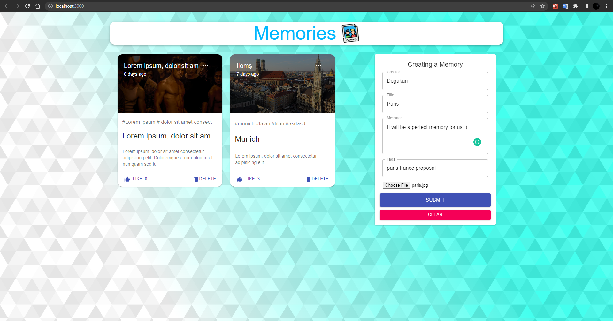
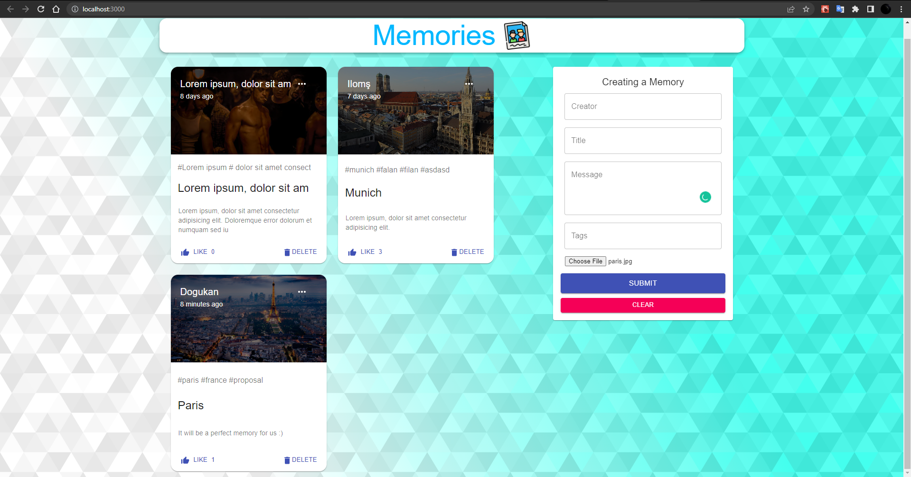
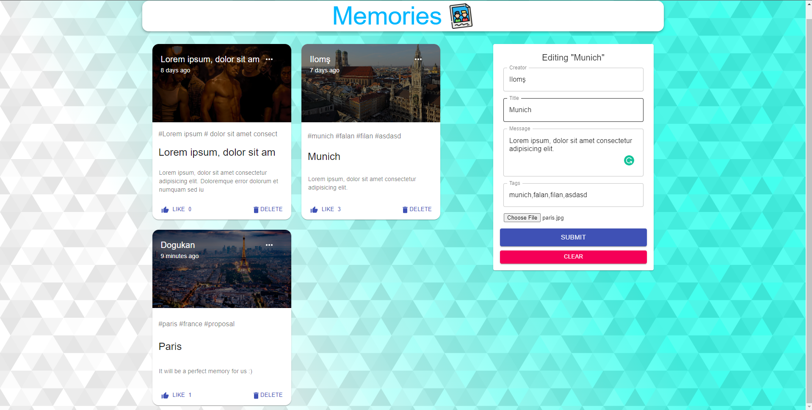

# MERN Memories App
<!-- ABOUT THE PROJECT -->
## About The Project

I developed a Full Stack MERN Application using React, Node.js, Express & MongoDB. The App is called "Memories" and it is a simple social media app that allows users to post interesting events that happened in their lives. I already know the frontend side of an application or website but while developing this application I have learned the backend side and connect database. Furthermore, I have learned the Redux library using it in my application.

### Project Images







### Built With

* [MongoDB](https://www.mongodb.com/)
* [Express.js](https://expressjs.com/)
* [React.js](https://reactjs.org/)
* [Node.js](https://nodejs.org/en/)
* [Redux](https://redux.js.org/)
* [Material UI](https://mui.com/)

<p align="right">(<a href="#top">back to top</a>)</p>

<!-- GETTING STARTED -->
## Getting Started

To get a local copy up and running follow these simple steps.

### Prerequisites

You need to install prerequisites before running the project. Please write the following code snips on your terminal.
* npm

  ```sh
  npm install npm@latest -g
  ```

### Installation

1. Connect the database by adding the URL that you get from [MongoDB](https://www.mongodb.com/atlas) to the .env file in the server folder.

2. Clone the repo

   ```sh
   git clone https://github.com/dyakupoglu/MERN_Memories_App.git
   ```
3. Install NPM packages (client and server side)

   ```sh
   npm install
   ```

<p align="right">(<a href="#top">back to top</a>)</p>

## License

Licensed under the [MIT License](https://github.com/dyakupoglu/MERN_Memories_App/blob/main/LICENSE)

<p align="right">(<a href="#top">back to top</a>)</p>